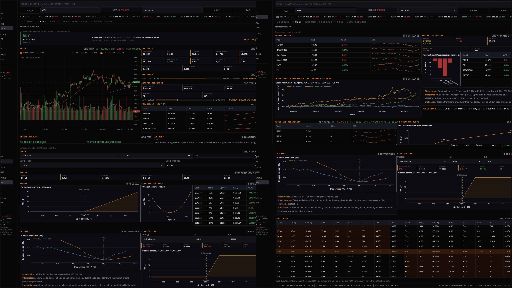

# François Rostaing

Institutional Finance Systems Builder  
Private Equity, Quantitative Finance, Python  
Geneva, Switzerland · CFA Level I Candidate (Aug 2026)

I build production-grade financial systems that replicate institutional workflows across private equity, systematic investing, and derivatives.

Website: https://frostaing.com

---

## What I Build

- End-to-end investment systems, not isolated models  
- Deterministic and testable financial engines  
- Integration of discretionary finance and systematic strategies  

---

## Flagship Systems

### Mini Bloomberg Terminal
Unified research platform integrating all systems into a single interface  

### AI Investment Research Agent
Six-engine deterministic system with composite scoring and confidence grading  

### Strategy Robustness Lab
Framework for validating strategies using PBO, deflated Sharpe, and stability testing  

---

## Systematic and Quant Engines

- Portfolio Optimization Engine  
- Factor Backtest Engine  
- TSMOM Engine  
- Volatility Regime Engine  

---

## Private Equity Systems

- M and A Database  
- PE Target Screener  
- LBO Engine  

---

## Derivatives

- Options Pricing Engine  

---

## What This Demonstrates

- Portfolio construction and optimization  
- Factor investing and signal design  
- Strategy validation and robustness testing  
- Private equity deal analysis  
- Derivatives pricing and risk management  

---

## Stack

Finance  
LBO, valuation, portfolio construction, factor investing, derivatives, risk modeling  

Technology  
Python, pandas, NumPy, SciPy, Streamlit, Plotly  
SQL using DuckDB and SQLite, Git  

---

## Current Work

- Building a portfolio of eleven integrated financial systems  
- Preparing for CFA Level I in August 2026  
- Developing advanced financial dashboards  

---

## Contact

GitHub: https://github.com/FrancoisRost1  
Website: https://frostaing.com  
Email: francois@frostaing.com
